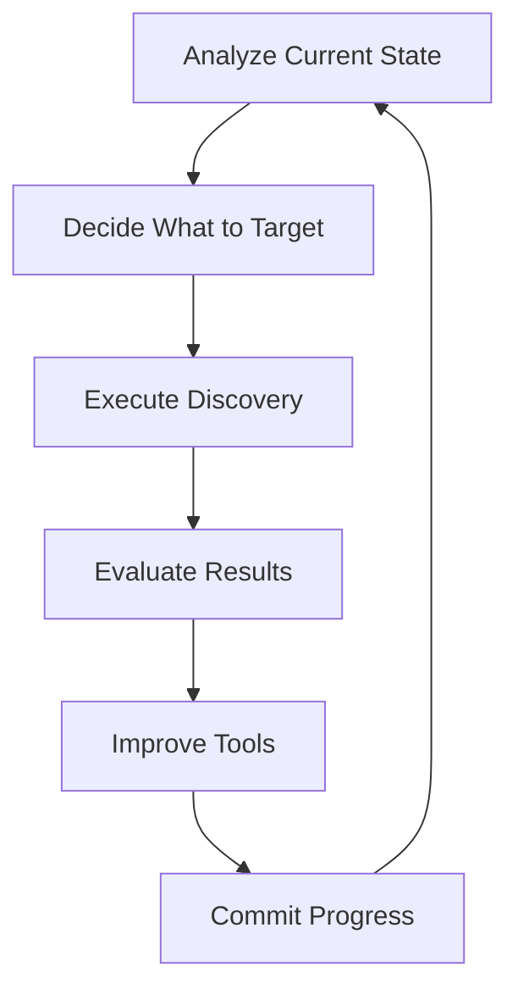

# Agent Workflow: AWS Error Discovery

This document describes an iterative, convergent process for discovering all missing errors in AWS SDK specifications. You are an agent working toward complete error coverage.

## Mission

**Goal:** Complete, typed error coverage for all AWS services.

AWS Smithy models omit many error types that operations actually throw. Your mission is to systematically discover these errors and record them to `spec/{service}.json`, achieving convergence where no gaps remain.

**Your role:**
1. **Analyze** - Assess current coverage, identify gaps
2. **Execute** - Run targeted discovery
3. **Improve** - Enhance tools when you hit limitations
4. **Repeat** - Iterate until converged

## Error Categories

The discovery process targets two main categories of errors:

### 1. Not Found / Malformed Errors

These errors occur when an operation references a resource that doesn't exist or has an invalid format.

**Discovery strategy:** Generate fake IDs/names and call operations directly.

| Pattern | Examples |
|---------|----------|
| `*NotFound` | `InvalidVpcID.NotFound`, `NoSuchBucket`, `ResourceNotFoundException` |
| `*Malformed` | `InvalidInstanceID.Malformed`, `InvalidParameterValue` |
| `NoSuch*` | `NoSuchKey`, `NoSuchUpload` |
| `Invalid*` | `InvalidSubnetId`, `InvalidSecurityGroupId` |

The naming varies by service—EC2 uses `Invalid*.NotFound`, S3 uses `NoSuch*`, Lambda uses `ResourceNotFoundException`—but they all represent "this thing doesn't exist."

### 2. Dependency Violation Errors

These errors occur when you try to delete or modify a resource that other resources depend on.

**Discovery strategy:** Walk operations in dependency order—create parent resources, then try to delete them while children exist.

| Pattern | Examples |
|---------|----------|
| `*InUse` | `VpcInUse`, `SubnetInUse`, `SecurityGroupInUse` |
| `DependencyViolation` | Can't delete VPC before subnets |
| `*HasAttachments` | Resource still has attached resources |
| `DeleteConflict` | IAM resource has dependent policies |

Example: You can't delete a VPC before deleting its subnets, internet gateways, and route tables. Attempting to do so produces `DependencyViolation` or `VpcInUse` errors.

### Why These Errors Matter

These errors are the most common runtime failures when working with AWS:
- **Not Found:** User provides invalid ID, resource was deleted, cross-region reference
- **Dependency Violation:** Cleanup order matters, orphaned resources block deletion

Having typed errors enables `Effect.catchTag("DependencyViolation", ...)` for proper error handling.

## The Workflow Loop



Each iteration follows this cycle. Don't just run `bun find` repeatedly—think about what you're learning and how to improve.

## Phase 1: Analyze Current State

Before running discovery, understand where you are.

### Check Global Coverage

```bash
# List services with existing patches
ls spec/

# Count operations covered per service
for f in spec/*.json; do
  echo "$(basename $f .json): $(cat $f | jq '.operations | keys | length')"
done
```

### Ad-Hoc Analysis with JavaScript

Use `bun -e` for exploratory queries. This is powerful for understanding gaps.

**Find services with zero coverage:**

```javascript
// Run: bun -e "..."
import { readdir } from 'fs/promises';
const specs = (await readdir('spec')).filter(f => f.endsWith('.json'));
const models = await readdir('aws-models/models');
const covered = new Set(specs.map(f => f.replace('.json', '')));
const uncovered = models.filter(m => !covered.has(m));
console.log('Uncovered services:', uncovered.slice(0, 20));
```

**Find delete operations missing NotFound errors:**

```javascript
// Load a service's Smithy model and spec, compare
const model = await Bun.file('aws-models/models/ec2/service/...').json();
const spec = await Bun.file('spec/ec2.json').json();

const deleteOps = Object.entries(model.shapes)
  .filter(([name, s]) => s.type === 'operation' && name.toLowerCase().includes('delete'))
  .map(([name]) => name.split('#')[1]);

for (const op of deleteOps) {
  const errors = spec.operations?.[op]?.errors ?? [];
  if (!errors.some(e => e.includes('NotFound'))) {
    console.log(`Gap: ${op} missing NotFound`);
  }
}
```

**Find resources without ID prefixes:**

```javascript
// Check id-generator.ts coverage against Smithy resources
const idGen = await Bun.file('scripts/find-errors/id-generator.ts').text();
const prefixMatch = idGen.match(/AWS_ID_PREFIXES[^}]+\{([^}]+)\}/s);
// Parse and compare against model resources
```

### When to Use Ad-Hoc vs. Encode in CLI

| Situation | Approach |
|-----------|----------|
| One-time exploration | Ad-hoc JavaScript |
| Understanding patterns | Ad-hoc JavaScript |
| Repeated analysis | Add CLI command |
| Cross-service comparison | Ad-hoc JavaScript |
| Standard workflow step | Encode in CLI |

## Phase 2: Decide What to Target

Based on your analysis, choose what to work on.

### Priority Tiers

1. **High-traffic services** - ec2, s3, lambda, dynamodb, iam, sts
2. **Services in active use** - Whatever the project currently uses
3. **Low-hanging fruit** - Services with few operations
4. **Completeness** - Everything else

### Operation Type Strategy

Different operation types yield different error patterns:

| Type | Typical Errors | Priority |
|------|---------------|----------|
| delete | `*NotFound`, `*Malformed` | High - easy wins |
| read/describe | `NoSuch*`, `*NotFound` | High - easy wins |
| create | `Invalid*`, `AlreadyExists` | Medium - may need FK refs |
| update/modify | `*NotFound`, `Invalid*` | Medium |
| action | Varies widely | Lower - case-by-case |

```bash
# Target delete operations first (highest success rate)
bun find --type delete ec2

# Then read operations
bun find --type read ec2
```

### Resource-Based Targeting

Focus on specific resources when you notice patterns:

```bash
# All VPC-related operations
bun find --resource Vpc,Subnet,RouteTable,InternetGateway ec2

# Limit scope to avoid rate limiting
bun find --resource Vpc --limit 20 ec2
```

## Phase 3: Execute Discovery

Run the find tool with your chosen targeting.

**Note:** Options must come BEFORE the service name (positional argument).

```bash
# Full discovery (use sparingly - can be slow)
bun find ec2

# Targeted discovery (preferred)
bun find --type delete --limit 50 ec2

# Preview what would be tested
bun find --dry-run ec2

# Force re-test operations that would be skipped
bun find --no-skip ec2
```

### Understanding Output

```
🔍 Finding errors for ec2

📊 Building topology...
   Found 423 operations across 89 resources
📂 Loading spec...
   Found 156 operations with patched errors

🔬 Testing 200 operations...

   🆕 createVpc → InvalidCidrBlock.Malformed
   ✓ deleteVpc → InvalidVpcID.NotFound
   🆕 attachInternetGateway → InvalidInternetGatewayID.NotFound

📊 Summary:
   Operations tested: 200
   Operations skipped: 156
   New errors discovered: 2
```

- **🆕** = New error discovered and recorded
- **✓** = Error triggered but already known
- **⏭️** = Skipped (expected error already in spec)

## Phase 4: Evaluate Results

After each run, interpret what you learned.

### New Errors Discovered

Success! The errors are now in `spec/{service}.json`. Next steps:
1. Regenerate SDK: `bun generate --sdk {service}`
2. Run again to verify convergence
3. Commit the spec file

### Malformed Errors

A `Malformed` error usually means the fake ID format is wrong. This indicates a tool improvement opportunity:

```
InvalidVpnGatewayID.Malformed
```

The ID generator doesn't know the correct prefix for `VpnGateway`. See Phase 5.

### No Errors / Empty Results

Possible causes:
- Operation doesn't validate inputs (rare)
- Operation requires real resources to fail
- Rate limiting prevented the call
- The fake input accidentally succeeded (very rare)

### Function Not Found

The operation exists in Smithy but isn't exported from the service module. This is normal for internal/deprecated operations. Skip these.

## Phase 5: Improve Tools

When you hit limitations, improve the tooling.

### Adding ID Prefixes

When you see `Malformed` errors, the fake ID format is wrong.

1. **Find the expected format** - Check AWS docs or error message hints
2. **Add to id-generator.ts:**

```typescript
// In AWS_ID_PREFIXES
VpnGateway: "vgw",
```

3. **Add a test:**

```typescript
// In id-generator.test.ts
it("generates VpnGateway ID", () => {
  expect(generateFakeId("VpnGateway")).toMatch(/^vgw-[a-f0-9]+$/);
});
```

4. **Run the test:**

```bash
# Run only scripts tests (fast)
bun test:scripts

# Or run a specific test file
bun vitest run scripts/find-errors/id-generator.test.ts
```

**Warning:** Do NOT run `bun vitest run` or `bun test` without a path — this runs all protocol and service tests which is slow and requires AWS credentials.

**Goal: Complete test coverage.** The `id-generator.test.ts` file should eventually include tests for every resource type variation:
- Every prefix in `AWS_ID_PREFIXES`
- Every entry in `NAME_BASED_RESOURCES`
- Every entry in `SPECIAL_FORMAT_RESOURCES`
- Edge cases like compound resource names

When adding a new prefix or format, always add a corresponding test. Over time, this ensures the id-generator is fully verified and regressions are caught immediately.

### Adding Name-Based Resources

Some resources use names instead of IDs:

```typescript
// In NAME_BASED_RESOURCES
NAME_BASED_RESOURCES.add("Function");  // Lambda functions
NAME_BASED_RESOURCES.add("Bucket");    // S3 buckets
```

### Adding Special Formats

Some resources have unique formats:

```typescript
// In SPECIAL_FORMAT_RESOURCES
Arn: "arn:aws:service:us-east-1:123456789012:resource/name",
```

### Adding Skip Rules

When you notice a convergence pattern, add a skip rule:

```typescript
// In runner.ts DEFAULT_SKIP_RULES
{
  name: "AlreadyExists for create",
  operationTypes: ["create"],
  errorPattern: "*.AlreadyExists",
  isSatisfied: (opErrors) =>
    opErrors.some((e) => e.includes("AlreadyExists")),
},
```

### Test-Driven Improvement

Always follow this pattern:
1. See the failure or gap
2. Add a test for expected behavior
3. Implement the fix
4. Verify the test passes
5. Run discovery again to confirm

## Phase 6: Commit Progress

After each meaningful iteration:

```bash
# Regenerate SDK with new errors
bun generate --sdk ec2

# Commit spec changes
git add spec/ec2.json
git commit -m "feat: add discovered errors for ec2"

# If you improved tools
git add scripts/find-errors/
git commit -m "fix: add VpnGateway ID prefix"
```

## Resource Management & Cleanup

**Critical:** The discovery process creates real AWS resources. Cleanup is essential to avoid:
- Accumulating orphaned resources
- Unexpected AWS charges
- Resource limit exhaustion

### The Cleanup Problem

When testing create operations, real resources are created. When testing dependency violations, we create parent resources, then try to delete them while children exist. This leaves resources behind.

### Current Infrastructure

The `scripts/find-errors/cleaner.ts` module provides topology-based cleanup:

```typescript
import { cleanService, generateCleanupPlan } from "./cleaner.ts";

// Preview what would be cleaned
const plan = await generateCleanupPlan("ec2");

// Clean all resources with "itty-" prefix (test resources)
await cleanService("ec2", ec2Module, { 
  prefix: "itty-",
  dryRun: true  // Preview first!
});
```

Key features:
- **Deletion order**: Children deleted before parents (via dependency graph)
- **Cleanable resources**: Only resources with both list and delete operations
- **Prefix filtering**: Clean only resources matching a pattern

### CLI Commands

```bash
# Clean all resources in a service
bun clean:aws ec2

# Dry run - show what would be deleted
bun clean:aws ec2 --dry-run

# Clean a different service
bun clean:aws lambda
```

The cleaner:
1. Builds the topology to understand resource dependencies
2. Lists all resources using list/describe operations
3. Deletes in dependency order (children before parents)
4. Skips public/shared resources (Snapshots, Images, etc.)

### Future CLI Enhancements

These features could be added to the cleaner:

```bash
# List all resources without deleting
bun clean:aws --list ec2

# Clean only resources matching a prefix
bun clean:aws --prefix itty- ec2

# Show cleanup plan (deletion order)
bun clean:aws --plan ec2
```

### Topology Requirements

The topology must understand each resource's lifecycle operations:

| Operation | Purpose | Examples |
|-----------|---------|----------|
| create | Creates the resource | `createVpc`, `runInstances` |
| list | Lists all instances | `describeVpcs`, `listBuckets` |
| read | Gets a single instance | `describeVpc`, `getBucket` |
| detach | Disassociates before delete | `detachInternetGateway` |
| delete | Removes the resource | `deleteVpc`, `terminateInstances` |

The topology already tracks these in `Resource.operations`:

```typescript
interface Resource {
  identifier: string | null;
  operations: {
    create: string | null;
    read: string | null;
    list: string | null;
    update: string[];
    detach: string[];
    delete: string | null;
  };
}
```

### Generic + Service-Specific Approach

AWS services follow patterns but aren't uniform. The cleanup system is:

**Generic layer** (works across services):
- Topology parsing from Smithy models
- Dependency graph computation
- Deletion order calculation
- List → Delete execution loop

**Service-specific adaptations** (case-by-case):
- Response parsing (where's the list of items?)
- Identifier extraction (what's the ID field?)
- Special cleanup sequences (EC2 instances need terminate, not delete)
- Multi-step cleanup (detach IGW → delete IGW)

### Improving Cleanup Coverage

When cleanup fails for a resource:

1. **Check topology** - Does the resource have list/delete operations?
2. **Check response parsing** - Is `extractInstances()` finding the items?
3. **Check identifier** - Is the correct ID field being used?
4. **Add service-specific logic** - Some resources need custom handling

Add improvements to:
- `topology.ts` - Better operation detection
- `cleaner.ts` - Response parsing patterns
- New service-specific cleaners if needed

### Cleanup Best Practices

1. **Use test prefixes** - All test resources should have `itty-{service}-` prefix
2. **Clean before and after** - Run cleanup before starting and after finishing
3. **Dry run first** - Always preview with `--dry-run` before real cleanup
4. **Check for orphans** - Manually verify via AWS Console periodically

## Convergence Verification

### Service-Level Convergence

A service is converged when:

```bash
bun find {service}
# Returns: "0 new errors discovered"
```

AND your analysis shows no obvious gaps:
- All delete operations have `*NotFound` or `*Malformed`
- All read operations have `NoSuch*` or `*NotFound`
- No `Malformed` errors indicating missing ID prefixes

### Global Convergence

All services are converged. Track progress:

```bash
# Services with any coverage
ls spec/ | wc -l

# Total operations covered
cat spec/*.json | jq '[.operations | keys | length] | add'
```

### Regression Prevention

After achieving convergence:
- Skip rules prevent re-testing satisfied operations
- Tests in `id-generator.test.ts` prevent ID format regressions
- Regenerating SDKs incorporates all discovered errors

## Key Files Reference

| File | Purpose | When to Modify |
|------|---------|----------------|
| `scripts/find-errors/index.ts` | CLI entry point | Adding new commands/options |
| `scripts/find-errors/topology.ts` | Smithy model parsing | Improving operation/resource detection |
| `scripts/find-errors/id-generator.ts` | Fake ID generation | Adding prefixes for new resource types |
| `scripts/find-errors/id-generator.test.ts` | ID generation tests | Every new prefix needs a test |
| `scripts/find-errors/runner.ts` | API calling, error recording | Adding skip rules, changing behavior |
| `scripts/find-errors/cleaner.ts` | Resource cleanup | Adding response patterns, cleanup logic |
| `spec/*.json` | Discovered errors | Automatically updated by runner |
| `aws-models/models/` | Smithy model source | Read-only reference |

## Common Patterns

### Error Patterns by Operation Type

| Operation | Expected Errors |
|-----------|-----------------|
| delete{Resource} | `Invalid{Resource}ID.NotFound` |
| describe{Resource} | `Invalid{Resource}ID.NotFound`, `NoSuch{Resource}` |
| get{Resource} | `NoSuch{Resource}`, `{Resource}NotFound` |
| create{Resource} | `Invalid*`, `{Resource}AlreadyExists` |
| attach{A}To{B} | `Invalid{A}ID.NotFound`, `Invalid{B}ID.NotFound` |

### ID Format Patterns

| Resource Type | ID Format | Prefix |
|---------------|-----------|--------|
| VPC resources | `{prefix}-{hex}` | vpc, subnet, igw, rtb, sg |
| EC2 instances | `i-{hex}` | i |
| AMIs | `ami-{hex}` | ami |
| S3 buckets | Name string | (none) |
| Lambda functions | Name string | (none) |
| IAM resources | ARN | arn:aws:iam:: |

## Troubleshooting

### Type Checking

**Do NOT use the root `tsconfig.json` for type checking** — it includes `./src/services` which is massive and extremely slow to compile.

If you need to type check the find-errors scripts, use a tsconfig that excludes `src/services`:

```bash
# Use tsconfig.scripts.json (excludes src/services)
bun tsgo -p tsconfig.scripts.json

# Or check individual files
bun tsgo --noEmit scripts/find-errors/cleaner.ts
```

The `src/services/*.ts` files are auto-generated and don't need type checking during development of the find-errors tools.

### Rate Limiting

```bash
# Reduce batch size
bun find --limit 20 ec2

# Add delay between calls (if supported)
# Or wait and retry
```

### Missing Service Module

```bash
# Generate the service first
bun generate --sdk newservice
bun find newservice
```

### Unexpected Errors

If you see errors that don't fit patterns:
1. Check if it's a real validation error (add to spec)
2. Check if it's a transient error (retry)
3. Check if input generation is wrong (improve id-generator)
