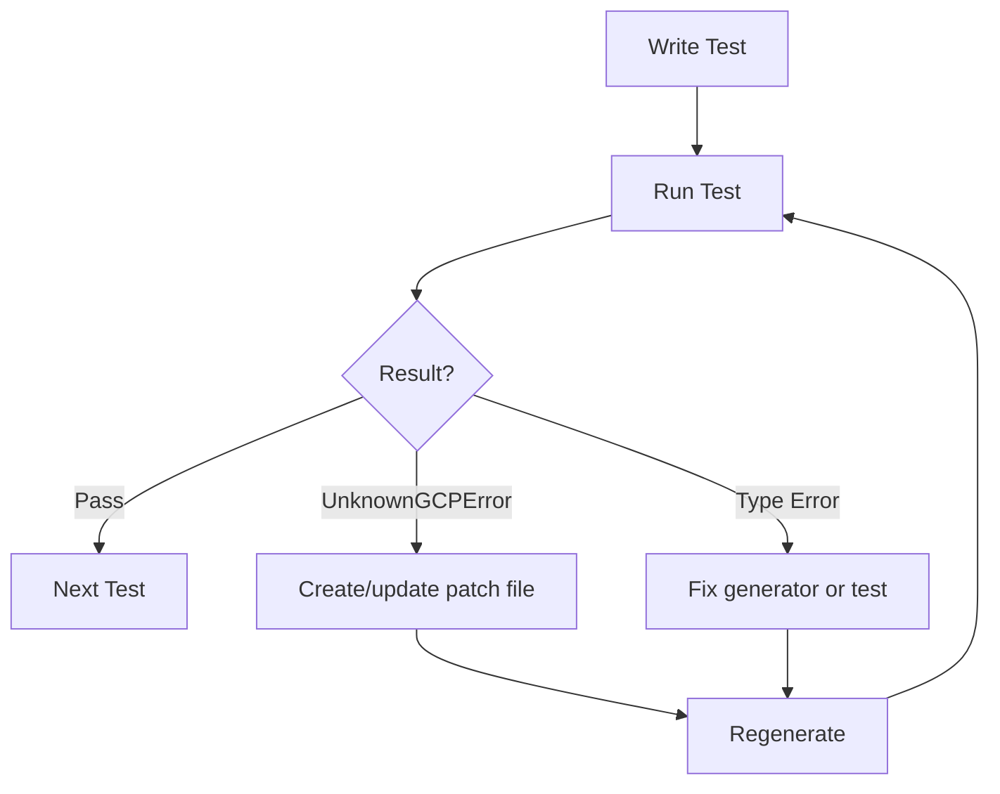

# distilled-gcp

> See [../AGENTS.md](../AGENTS.md) for ecosystem overview and shared TDD patterns.

Effect-native GCP SDK generated from [Google API Discovery Documents](https://developers.google.com/discovery/v1/getting_started) with exhaustive error typing.

## Architecture

```
Discovery API → specs/*.json → scripts/generate-clients.ts → src/services/*.ts → Runtime
     ↓              ↓                    ↓                         ↓                ↓
  API Catalog   Local Cache        Code Generator           Effect Schemas     REST JSON Client
```

**Two-phase pipeline:**
1. `bun fetch-specs` — Downloads discovery documents from Google's Discovery API to `specs/`
2. `bun generate` — Generates Effect-native TypeScript from the cached specs

## Commands

```bash
bun setup                                    # Create directories
bun fetch-specs                              # Download all discovery docs
bun fetch-specs --service storage            # Download single service
bun fetch-specs --all                        # All versions (not just preferred)
bun generate                                 # Generate all services
bun generate --service storage               # Generate single service
bun generate --service storage --version v1  # Specific version
bun vitest run ./test/services/              # Run tests
bun tsc -b                                   # Type check
```

## Key Files

| File | Purpose |
|------|---------|
| `scripts/fetch-specs.ts` | Downloads discovery docs to `specs/` |
| `scripts/generate-clients.ts` | Code generator from discovery docs |
| `specs/{name}-{version}.json` | Cached discovery documents |
| `specs/_manifest.json` | Index of all fetched specs |
| `patch/{service}/{operation}.json` | Error patches per operation |
| `patch/{service}.json` | Service-level patches |
| `src/services/{name}-{version}.ts` | Generated client (DO NOT EDIT) |
| `src/client/api.ts` | Operation factory (make + makePaginated) |
| `src/client/request-builder.ts` | Builds HTTP requests from annotated schemas |
| `src/client/response-parser.ts` | Parses responses and matches errors |
| `src/traits.ts` | Schema annotations for HTTP bindings |
| `src/auth.ts` | Authentication (service accounts + ADC) |
| `src/errors.ts` | Base error types (UnknownGCPError, etc.) |
| `src/category.ts` | Error categories for retry logic |
| `src/retry.ts` | Retry policy infrastructure |

## Authentication

Two methods supported:

### Service Account (production/CI)
```typescript
import * as Auth from "distilled-gcp/Auth";

// From JSON key file
const authLayer = Auth.fromServiceAccountFile("./service-account.json");

// From parsed key object
const authLayer = Auth.fromServiceAccountKey(keyObject);
```

### Application Default Credentials (development)
```bash
# First, authenticate with gcloud:
gcloud auth application-default login
```

```typescript
import * as Auth from "distilled-gcp/Auth";

// Auto-detects credentials (env var, gcloud, metadata server)
const authLayer = Auth.fromADC();

// Or from environment:
const authLayer = Auth.fromEnv(); // checks GOOGLE_ACCESS_TOKEN, then ADC
```

## GCP Error Format

GCP APIs return errors as:
```json
{
  "error": {
    "code": 404,
    "message": "The resource was not found",
    "status": "NOT_FOUND",
    "errors": [{ "message": "...", "domain": "global", "reason": "notFound" }]
  }
}
```

### gRPC Status Codes → Categories

| gRPC Status | HTTP | Category |
|-------------|------|----------|
| `OK` | 200 | — |
| `CANCELLED` | 499 | — |
| `UNKNOWN` | 500 | ServerError |
| `INVALID_ARGUMENT` | 400 | BadRequestError |
| `DEADLINE_EXCEEDED` | 504 | TimeoutError |
| `NOT_FOUND` | 404 | NotFoundError |
| `ALREADY_EXISTS` | 409 | ConflictError |
| `PERMISSION_DENIED` | 403 | AuthError |
| `UNAUTHENTICATED` | 401 | AuthError |
| `RESOURCE_EXHAUSTED` | 429 | ThrottlingError/QuotaError |
| `FAILED_PRECONDITION` | 400 | PreconditionError |
| `ABORTED` | 409 | ConflictError |
| `OUT_OF_RANGE` | 400 | BadRequestError |
| `UNIMPLEMENTED` | 501 | — |
| `INTERNAL` | 500 | ServerError |
| `UNAVAILABLE` | 503 | UnavailableError (retryable) |
| `DATA_LOSS` | 500 | ServerError |

## Error Patching

Patches are stored per-operation at `patch/{service}/{operation}.json`.

### Workflow

When you see `UnknownGCPError`:

1. Extract the error details from the failure:
   ```bash
   DEBUG=1 bun vitest run ./test/services/storage.test.ts
   ```

2. Create or update `patch/{service}/{operation}.json`:
   ```json
   {
     "errors": {
       "BucketNotFound": [
         { "httpStatus": 404, "reason": "notFound" }
       ]
     },
     "errorCategories": {
       "BucketNotFound": ["NotFoundError"]
     }
   }
   ```

3. Regenerate: `bun generate --service {service}`

4. Import the new error class in your test and verify.

### Matcher Fields

| Field | Description |
|-------|-------------|
| `httpStatus` | HTTP status code (404, 403, etc.) |
| `status` | gRPC status name ("NOT_FOUND", "PERMISSION_DENIED") |
| `reason` | Error reason from details ("notFound", "forbidden") |
| `domain` | Error domain ("global", "storage") |
| `message` | Message matcher (`{ includes: "..." }` or `{ matches: "..." }`) |

### Response Schema Patching

```json
{
  "errors": { ... },
  "response": {
    "properties": {
      "location": { "addValues": ["US-CENTRAL1"] },
      "settings.field": { "nullable": true },
      "items[].name": { "optional": true }
    }
  }
}
```

## Service-Level Patches

For errors that apply to all operations in a service:

```json
// patch/storage.json
{
  "errors": {
    "RateLimited": [
      { "httpStatus": 429, "status": "RESOURCE_EXHAUSTED" }
    ]
  },
  "errorCategories": {
    "RateLimited": ["ThrottlingError", "RetryableError"]
  },
  "operations": {
    "insertBuckets": {
      "errors": {
        "BucketAlreadyExists": [
          { "httpStatus": 409, "status": "ALREADY_EXISTS" }
        ]
      }
    }
  }
}
```

## Testing Protocol

### Test Organization

```typescript
describe("Storage", () => {
  describe("insertBuckets", () => {
    test("happy path - creates bucket", () =>
      Effect.gen(function* () {
        const bucket = yield* Storage.insertBuckets({
          project: projectId,
          body: { name: "distilled-gcp-test-bucket" },
        });
        expect(bucket.name).toBe("distilled-gcp-test-bucket");
      }));

    test("error - BucketAlreadyExists", () =>
      Storage.insertBuckets({
        project: projectId,
        body: { name: "existing-bucket" },
      }).pipe(
        Effect.flip,
        Effect.map((e) => expect(e._tag).toBe("BucketAlreadyExists")),
      ));
  });
});
```

### Resource Naming

`distilled-gcp-{service}-{testname}` — deterministic, enables cleanup

### TDD Loop



## Environment

```bash
# Option 1: Service Account
GOOGLE_APPLICATION_CREDENTIALS=./service-account.json

# Option 2: ADC (run this first)
gcloud auth application-default login

# Project ID (required for project-scoped ops)
GOOGLE_CLOUD_PROJECT=my-project

# Or direct token
GOOGLE_ACCESS_TOKEN=ya29.xxx...
```

## Discovery Document Format

GCP discovery docs describe APIs with:
- `schemas` — JSON Schema objects for request/response types
- `resources` — Nested resource hierarchy with methods
- `methods` — HTTP method, path template, parameters, request/response refs
- `parameters` — Path and query parameters with types/validation

URI templates use `{var}` for simple expansion and `{+var}` for reserved expansion (preserves `/`).
